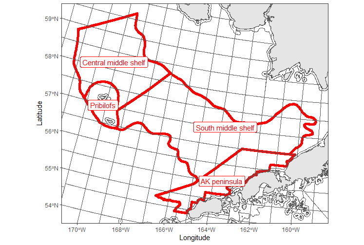

## Compare chlorophyll products

We compare chlorophyll values from MODIS, VIIRS, and OC-CCI for the Southeastern Bering Sea (SEBS) and Western and Central Gulf of Alaska (WCGOA). Chlorophyll .nc files were downloaded from coastwatch and values were aggregated by region. The period of analysis is April-June. The effects of adjusting a depth filter are also presented for the WCGOA. 

**Create functions for joining chla products and plotting values over time**

```{r, warning=FALSE, message=FALSE}
library(tidyverse)
library(lubridate)
library(sf)
library(AKmarineareas)

#join aggregated products
chla_join<-function(x,y,z){
  x%>%left_join(y, by=c("YEAR"="YEAR"))%>%
    left_join(z, by=c("YEAR"="YEAR"))
}
#join depth comparisons 
chla_join_depth<-function(w,x,y,z){
  w%>%left_join(x, by=c("YEAR"="YEAR"))%>%
    left_join(y, by=c("YEAR"="YEAR"))%>%
    left_join(z, by=c("YEAR"="YEAR"))
}

#time series of the three products
chla_timeplot<-function(x, indicator) {
  ggplot()+
  geom_line(data=x, aes(x=YEAR,y=OCCCI_VALUE_NF), color="red")+
  geom_line(data=x, aes(x=YEAR,y=MODIS_VALUE_NF), color="blue")+
  geom_line(data=x, aes(x=YEAR,y=VIIRS_VALUE), color="green")+
  ylab("chla")+
    ylim(c(0,5))+
  ggtitle(paste(indicator, "\n OC-CCI=red, MODIS=blue, VIIRS=green"))
}

#time series with depth filters and no depth filters
chla_timeplot_depth<-function(x, indicator) {
  ggplot()+
  geom_line(data=x, aes(x=YEAR,y=OCCCI_VALUE_NF), color="red")+
  geom_line(data=x, aes(x=YEAR,y=OCCCI_VALUE_F), color="red", lty=2)+
  geom_line(data=x, aes(x=YEAR,y=MODIS_VALUE_NF), color="blue")+
  geom_line(data=x, aes(x=YEAR,y=MODIS_VALUE_F), color="blue", lty=2)+
  ylab("chla")+
    ylim(c(0,5))+
  ggtitle(paste(indicator, "\n OC-CCI=red, MODIS=blue, dashed=depth filtered"))
}

```

## SEBS shelf

On the southeastern Bering Sea shelf, MODIS is consistently higher than VIIRS and OC-CCI. Not only are VIIRS and MODIS annual trends sometimes in opposition, in some cases the OC-CCI product follows a different trajectory than either VIIRS or MODIS (e.g. 2014-2015 and 2020-2021).


Bering Sea Integrated Ecological Research Project (BSIERP) southern and middle shelf regions were used in this analysis
```{r}
#MODIS
mod_ebs<-readRDS("Data/MODIS/merged_8day_2003_2021_EBS.RDS")
#occci
occ_ebs<-readRDS("Data/OCCCI/occ8_strata_ebs.RDS")
#viirs
viirs<-readRDS("Data/VIIRS/viirs_strata.RDS")

#define indicator
indicator<-"BSIERP middle shelf regions"

#MODIS
mod_esr_ndf<-mod_ebs%>%
  mutate(month=month(date),
         YEAR=year(date),
         ) %>%
  filter(bsierp_id %in% c(1,3,5,6) & month %in% c(4,5,6) )%>%
  group_by(YEAR)%>%
  summarise(MODIS_VALUE_NF=round(mean(chlorophyll, na.rm=T),2),
            MODIS_N=n())

#oc-cci 
occci_esr_ndf<-occ_ebs%>%
  filter(BSIERP_ID %in% c(1,3,5,6) & month %in% c(4,5,6))%>%
  mutate(YEAR=year) %>%
  group_by(YEAR)%>%
  summarise(OCCCI_VALUE_NF=round(mean(chlorophyll, na.rm=T),2),
            OCCCI_N=n())

#viirs
viirs_bsierp<-viirs%>%
  filter(BSIERP_ID %in% c(1,3,5,6) & month %in% c(4,5,6))%>%
  mutate(YEAR=year) %>%
  group_by(YEAR)%>%
  summarise(VIIRS_VALUE=round(mean(chlorophyll, na.rm=T),2),
            VIIRS_N=n())

#join
bsierp<-chla_join(occci_esr_ndf, mod_esr_ndf, viirs_bsierp)

#plot timeseries
chla_timeplot(bsierp, indicator)
```


## WCGOA
On the WCGOA shelf (-10 to -200m), MODIS is consistently higher than VIIRS and OC-CCI. The magnitude of the difference between MODIS and VIIRS/OC-CCI appears somewhat less than in the Bering Sea. Again, MODIS and VIIRS do not always follow the same annual trends. In this case OC-CCI follows the same pattern as at least one of the other products, or appears to "split the difference". The application of a depth filter (-50 rather than -200m) and the exclusion of coastal waters (within 3 miles of shore) had minimal influence on mean chlorophyll values or the differnces between products.


NMFS areas 610, 620, and 630 comprise the WCGOA for this analysis

```{r, warning=FALSE, message=FALSE}
#load dgoa data
#remove ebs
rm(mod_ebs); rm(occ_ebs)
#MODIS
mod_goa<-readRDS("Data/MODIS/merged_8day_2003_2021_GOA.RDS")
#occci
occ_goa<-readRDS("Data/OCCCI/occ8_strata_goa.RDS")

#define indicator
indicator<-"Spring_Chlorophylla_Biomass_WCGOA_Satellite"
#MODIS
#recalculate indicator
mod_WGOA_10 <- mod_goa %>%
  mutate(month=month(date),
         YEAR=year(date)) %>%
  filter(nmfsarea %in% c(610, 620, 630) & month%in% c(4:6) & depth<(-10) & depth>(-200)) %>%
  group_by(YEAR) %>%
  summarise(MODIS_VALUE_NF=mean(chlorophyll,na.rm=TRUE),
            MODIS_N=n())

#50m filter
mod_WGOA_50 <- mod_goa %>%
  mutate(month=month(date),
         YEAR=year(date)) %>%
  filter(nmfsarea %in% c(610, 620, 630) & month%in% c(4:6) & depth<(-50) & depth>(-200) & statefed=="FED") %>%
  group_by(YEAR) %>%
  summarise(MODIS_VALUE_F=mean(chlorophyll,na.rm=TRUE))

#OCC
occci_WGOA_10<-occ_goa%>%
  filter(NMFS_REP_AREA%in% c(610, 620, 630) & month %in% c(4:6) & depth<(-10) & depth>(-200))%>%
   mutate(YEAR=year) %>%
  group_by(YEAR)%>%
  summarise(OCCCI_VALUE_NF=mean(chlorophyll,na.rm=TRUE),
            OCCCI_N=n())

occci_WGOA_50<-occ_goa%>%
  filter(NMFS_REP_AREA%in% c(610, 620, 630) & month %in% c(4:6) & depth<(-50) & depth>(-200) & WATERS_COD== "FED")%>%
 mutate(YEAR=year) %>%
  group_by(YEAR)%>%
  summarise(OCCCI_VALUE_F=mean(chlorophyll,na.rm=TRUE))


#VIIRS
VIIRS_WGOA<-viirs%>%
  filter(NMFS_REP_AREA%in% c(610, 620, 630) & month %in% c(4:6) & depth<(-10) & depth>(-200))%>%
   mutate(YEAR=year) %>%
  group_by(YEAR)%>%
  summarise(VIIRS_VALUE=mean(chlorophyll,na.rm=TRUE),
            VIIRS_N=n())

#join
wgoa<-chla_join(occci_WGOA_10,  mod_WGOA_10, VIIRS_WGOA)

#plot
chla_timeplot(wgoa, indicator)

#join depth
wgoa_2<-chla_join_depth(occci_WGOA_10, occci_WGOA_50, mod_WGOA_10, mod_WGOA_50)

#depth filter plot
chla_timeplot_depth(wgoa_2, indicator)

```
