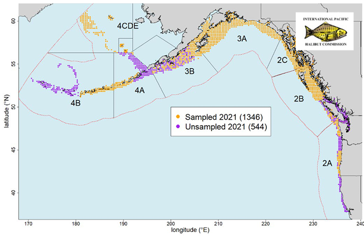

```{r setup, include=FALSE}
knitr::opts_chunk$set(echo = TRUE)
```

Jane Sullivan^1^, Cindy Tribuzio^1^, Matt Callahan^2^, Niels Leuthold^2^, Jean Lee^2^

^1^Alaska Fisheries Science Center (AFSC), Auke Bay Labs (ABL), Marine Ecology and Stock Assessment (MESA)<br>
^2^Alaska Fisheries Information Network (AKFIN), Pacific States Marine Fisheries Commission (PSMFC)

Last updated: **2022-07-20**

For questions about the data, abundance index estimates, or database queries please contact
[jane.sullivan@noaa.gov](mailto:jane.sullivan@noaa.gov) or [cindy.tribuzio@noaa.gov](mailto:cindy.tribuzio@noaa.gov)

For questions about AKFIN database access, please contact [matt.callahan@noaa.gov](mailto:matt.callahan@noaa.gov)

## Background

The International Pacific Halibut Commission (IPHC) conducts an annual fisheries-independent setline survey (FISS) that spans the U.S. West Coast, Canada, Gulf of Alaska (GOA), eastern Bering Sea (BS), and Aleutian Islands (AI). Though the IPHC FISS is designed to inform the management and stock assessment of Pacific halibut, it has the potential to inform other groundfish stock assessments, e.g., Pacific cod, yelloweye rockfish, spiny dogfish, arrowtooth flounder, and some sharks and skates. 

In this document, we summarize documentation, estimation methods, and data caveats for IPHC FISS abundance indices. These indices include catch per unit effort (CPUE) and Relative Population Numbers (RPNs). The RPN is the number of fish caught per hook in a set (CPUE) weighted by the area size (km2) of a depth stratum within a geographic area. RPNs are defined using NMFS bottom trawl survey area sizes and depth strata, and the RPN point estimates and variances can be summed to across areas and/or depths. In contrast, CPUE is not summable and therefore is estimated at FMP subarea (e.g., Western GOA) and FMP levels. Ultimately, these indices provide an alternative or supplement to existing sources of abundance information (e.g. Alaska Fisheries Science Center (AFSC) bottom trawl survey biomass or AFSC longline survey RPNs) and may be used to inform stock assessments.

IPHC FISS data are accessed from the IPHC website and stored in the Alaska Fisheries Information Network (AKFIN) database. They are queried and analyzed by AFSC staff, and final results are returned to AKFIN and stored in separate database tables. The IPHC FISS abundance indices are accessible by stock assessment scientists through AKFIN and are available at a one year lag to the IPHC FISS (e.g., indices from the 2021 survey are available in 2022). 

## Raw data access, data processing, and database structure

IPHC FISS data are publicly available on the [IPHC website](https://iphc.int/data/datatest/fishery-independent-setline-survey-fiss) and accessed using a Tableau data dashboard, which allows users to manually generate customized queries. In order to standardize annual data access for the IPHC RPN project, AKFIN analysts extract data from the IPHC website and load it directly to the AKFIN database (personal communication Niels Leuthold, AKFIN, 2021). This method of data access reduces the likelihood of human error when using the Tableau data dashboard and makes these data readily available to all AKFIN users.

Raw IPHC FISS and associated metadata tables are stored in the IPHC schema of the AKFIN database. These tables include:

| Table | Description |
| --- | ----------- |
| FISS_METADATA | Column names and descriptions for the FISS_SET_P_HALB table |
| FISS_METADATA_AKFIN_NAMES | Translation table and metadata for the FISS_METADATA table |
FISS_SET_P_HALB | Detailed longline set information, with associated catch records for legal and sublegal Pacific halibut. This table can be joined with the non-halibut catch table (FISS_NON_P_HALB) using the SET_KEY column (STLKEY on the IPHC website). |
| FISS_NON_P_HALB | Set-level catch records for all hook and species observations except Pacific halibut. This table can be joined with the Pacific halibut catch table (FISS_SET_P_HALB) using the SET_KEY column (STLKEY on the IPHC website). |
| FISS_PRP_CODES | Look up table of project purpose codes, which is defined at the station level |

These data are queried directly into R and run through a series of R scripts hosted at [https://github.com/JaneSullivan-NOAA/iphc-rpn](https://github.com/JaneSullivan-NOAA/iphc-rpn). Finalized data and results are then transferred to AKFIN using a data uploader tool, which ensures data types and structures maintain consistency over time. 

The finalized set data and RPN/CPUE results are stored in the AFSC_HOST schema in the AKFIN database in the following tables:

| Table | Description |
| --- | ----------- |
| FISS_CLEANED | Finalized set data used as inputs to the CPUE/RPN analysis. This data set is the product of a join between the FISS_SET_P_HALB and FISS_NON_P_HALB and includes catch records for every fish species encountered on the IPHC FISS. Any catch records removed from the raw data and omitted from the CPUE/RPN analysis are summarized in the FISS_STATIONS_REMOVED table. |
| FISS_CPUE and FISS_RPN | Finalized results for the CPUE/RPN analysis by species, year, and strata, including the number of sets, sets with positive catch records, and results from the bootstrap analysis. The FISS_CPUE have an AREA_COMBO field that describes the underlying area definitions. The FISS_RPN are always defined in the same way the same way using the AFSC bottom trawl survey depth strata and FMP subareas. |
| FISS_STATIONS_REMOVED | A record of full or partial set removed from the raw set/catch record data with the associated rationale. |

## Data caveats

The IPHC survey design was relatively consistent by depth and area in the GOA and BSAI from 1998 – 2019, with the exception of additional stations in the AI in 2017 (Bower’s Bank and Ridge area). Since then, the IPHC has made numerous changes to the sampling design. Data users should be aware of ongoing changes to the IPHC survey design consider the effects of these changes on the interpretation of the indices for their stock. 

Specific examples of these changes in the GOA and BSAI that data users should be aware of include the following:

* Additional sampling occurred along Bower’s Bank and Ridge in the AI in 2017
* No sampling occurred in the WGOA, AI, or EBS in 2020 due to COVID-19
*  Large reductions in sampling in the WGOA, AI, and EBS starting in 2021. These reductions are not random and are based on an optimized sampling for Pacific halibut. For example, the map below shows the 2021 IPHC-endorsed survey design (p. 11 of https://www.iphc.int/uploads/pdf/am/am098/iphc-2022-am098-r.pdf). The 2022 IPHC-endorsed design along with proposed designs for 2023 and 2024 are found in Appendices IV and V of the same document. 
* Redistribution of sampling effort by depth strata in the CGOA and EGOA starting in 2021 based on the optimized sampling strategy for Pacific halibut. 

.

Data users can evaluate sample sizes using the `N_STATIONS` (number of stratum-specific sets or fishing events) and `N_POS_CATCH` (number of stratum-specific sets or fishing events with positive catch for a given species) columns in the FISS_CPUE or FISS_RPN tables located in AKFIN’s AFSC_HOST schema. For more detailed information spatial or depth data, users can use the FISS_CLEANED data in AKFIN’s AFSC_HOST schema.

## Bootstrap methods

Variance estimates for IPHC FISS abundance indices are based on a bootstrap analysis using an ordinary nonparametric (i.e. resampling) approach in the R library ‘boot’ (Canty and Ripley 2021; Davison and Hinkley 1997). Each data set was defined as the number ($n$) of CPUE observations (number of individuals caught per hook; $\widehat \theta$) within a geographic area ($k$), such that there was one observation for each station ($i$) and depth stratum ($j$) combination within the area $[\widehat\theta_1,... \widehat\theta_n]$. A total of 1,500 bootstrap replicates ($B$) were run for each species and geographic area. Each bootstrap replicate was comprised of a set of $n$ bootstrap samples $[\widehat\theta_1^*,…\widehat\theta_n^*]$ where each $\widehat\theta_{(i,j,k)}^*$  was a random sample with replacement from the original dataset. For each bootstrap replicate, the geographic area mean RPN was calculated as the sum of area-weighted CPUEs over all depth strata 

$$E[\bar\psi_k]^* = \sum\limits_j\sum\limits_i\frac{\widehat\theta_{i,j,k}^*w_{j,k}} { n_{j,k}^*}.$$

The estimate of the geographic mean RPN was calculated as the mean of the bootstrap replicates

$$E[\bar\psi_k] = \frac{1}{B
}\sum\limits_BE[\bar\psi_k]^*.$$

and the associated bootstrap variance estimate was given by

$$\widehat V[\bar\psi_k] = \frac{1}{B-1}\sum\limits_B(E[\bar\psi_k]^* - E[\bar\psi_k]).$$

## Example

The following R code includes an example of how to query the IPHC FISS RPNs for spiny dogfish in the GOA and plot the time series.

#### Connect to the AKFIN database and query the spiny dogfish relative population numbers in the Central GOA and East Yakutat/Southeast management areas

```{r message=FALSE, warning=FALSE, results=FALSE, tidy=TRUE, tidy.opts=list(width.cutoff=60)}
libs <- c('dplyr', 'tidyr', 'RODBC', 'ggplot2','getPass')
if(length(libs[which(libs %in% rownames(installed.packages()) == FALSE )]) > 0) {install.packages(libs[which(libs %in% rownames(installed.packages()) == FALSE)])}
lapply(libs, library, character.only = TRUE)
# Enter your username and password for the AKFIN database. Note that these credentials are different than what you may use to access AKFIN Answer. Contact AKFIN for more information.
channel_akfin <- odbcConnect("akfin", uid = getPass(msg="username"),  pwd=getPass(), believeNRows=FALSE)

dogfish <- sqlQuery(channel_akfin, query = ("
                select    *
                from      afsc_host.fiss_rpn
                where     species in ('Spiny dogfish') and fmp_sub_area in ('CGOA', 'EY/SE')
                ")) %>% 
  dplyr::rename_all(tolower) 

```

#### Plot the IPHC relative pouplation numbers for spiny dogfish

```{r message=FALSE, warning=FALSE}
ggplot(data = dogfish, aes(x = survey_year)) +
  geom_ribbon(aes(ymin = fmp_lci, ymax = fmp_uci), alpha = 0.2, col = NA) +
  geom_point(aes(y = fmp_rpn)) +
  geom_line(aes(y = fmp_rpn)) +
  facet_wrap(~fmp_sub_area) +
  scale_y_continuous(labels = scales::comma) +
  labs(x = 'Year', y = 'RPN')

```

#### Plot the number of total sets and sets with positive catch for spiny dogfish by depth strata in order to evaluate changes in sampling effort over time 
```{r message=FALSE, warning=FALSE }
nsum <- dogfish %>% 
         select(survey_year, rpn_strata,
                total = n_stations, pos_catch = n_pos_catch) %>% 
  tidyr::pivot_longer(cols = c('total', 'pos_catch'))

ggplot(data = nsum, aes(x = survey_year, y = value, lty = name, shape = name)) +
  geom_point() +
  geom_line() +
  facet_wrap(~rpn_strata, ncol = 2) +
  scale_y_continuous(labels = scales::comma) +
  labs(x = 'Year', y = 'Number of sets')

```

## References

Canty, A. and B. Ripley. 2021. boot: Bootstrap R (S-Plus) Functions. R package version 1.3-27.

Davison, A. C. and D. V. Hinkley. 1997. Bootstrap Methods and Their Applications. Cambridge University Press, Cambridge. ISBN 0-521-57391-2.

Echave, K., C. Rodgveller, and S. K. Shotwell. 2013. Calculation of the geographic sizes used to create population indices for the Alaska Fisheries Science Center longline survey. U.S. Dep. Commer., NOAA Tech. Memo. NMFS-AFSC-253, 93 p.

R Core Team (2021). R: A language and environment for statistical computing. R Foundation for Statistical Computing, Vienna, Austria. https://www.R-project.org/.

## Helpful links for IPHC survey design and history

https://iphc.int/management/science-and-research/fishery-independent-setline-survey-fiss

https://iphc.int/uploads/pdf/tr/IPHC-2012-TR058.pdf 


